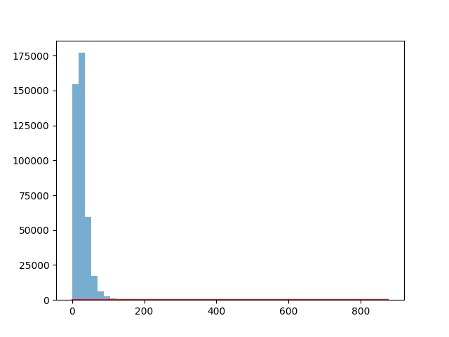

# Probability Density Functions

The dataset used is the **India Air Quality Data** from Kaggle. It contains air quality measurements across Indian cities.

Dataset Source:
[https://www.kaggle.com/datasets/shrutibhargava94/india-air-quality-data](https://www.kaggle.com/datasets/shrutibhargava94/india-air-quality-data)

We use **NO₂ (Nitrogen Dioxide)** concentration as the feature variable.

## Implementation Steps

1. Load dataset using pandas
2. Extract `no2` column
3. Remove missing values
4. Compute transformation parameters (`ar`, `br`)
5. Transform data
6. Estimate μ and σ²
7. Compute λ and c
8. Plot histogram vs learned PDF

## Visualization

